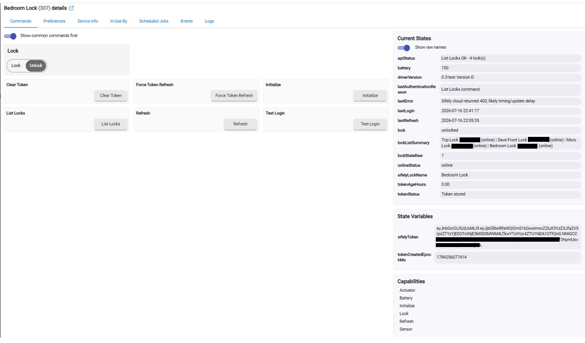
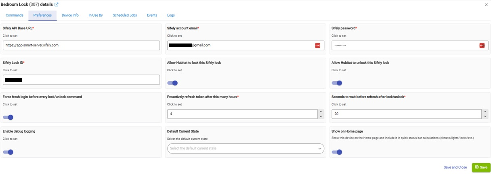

# Unofficial Sifely S WiFi Lock Driver for Hubitat
## Screenshots

### Driver Commands

### Driver Preferences

An unofficial Hubitat cloud driver for Sifely S WiFi smart locks.
This project is not affiliated with or endorsed by Sifely.

## Current Release

**Version 1.0.0 — Production Release**

Version 1.0.0 is the production release of the tested internal build **0.3-test Version D**. The production file retains the tested Version D behavior; only the public version and driver name were changed.

## Tested Functions

- Manual lock and unlock
- Refresh and physical lock-state synchronization
- Scheduled proactive token refresh, default 4 hours
- Fresh authentication before lock and unlock commands when enabled
- Authentication-failure detection with one retry
- **List Locks**, including lock names, Lock IDs, and online status
- Multiple Sifely locks on one account
- Hubitat Basic Rules
- Geofence departure locking
- Geofence arrival unlocking

## Features

- Hubitat Lock capability
- Lock and unlock commands
- Battery reporting
- Online/offline status
- Sifely lock name
- Configurable proactive token refresh
- Optional fresh authentication before each lock/unlock command
- Delayed post-command refresh
- Diagnostic login, token refresh, token clearing, and lock-list commands

## Installation

1. In Hubitat, open **Drivers Code**.
2. Choose **New Driver**, or open the prior Sifely driver to replace it.
3. Copy the contents of `Sifely-WiFi-Lock-Driver.groovy`.
4. Paste the code into Hubitat and select **Save**.
5. Assign the driver type **Sifely WiFi Lock** to each Sifely device.
6. Enter the Sifely account email, password, and Lock ID.
7. Enable remote locking and remote unlocking as appropriate.
8. Select **Save Preferences**, then run **Initialize** and **Refresh**.

## Finding Lock IDs

Run **List Locks** from the Hubitat device page. The driver logs each lock and records a summary in the `lockListSummary` attribute.

## Recommended Tested Settings

- Proactive token refresh: **4 hours**
- Force fresh login before every lock/unlock command: **Enabled**
- Refresh after command: **20 seconds**

Remote unlock defaults to disabled and must be enabled deliberately.

## Important Notes

- This is an unofficial community integration and is not affiliated with or supported by Sifely or Hubitat.
- Lock control and status depend on the Sifely cloud service and an active internet connection.
- The driver uses undocumented cloud endpoints that Sifely could change.
- Do not post credentials, authentication tokens, or identifying lock information in public logs or screenshots.

## Planned for Version 1.5.0

- A clearer selectable authentication mode instead of the current tested checkbox behavior
- Additional diagnostic information

## License

MIT License. See `LICENSE`.
